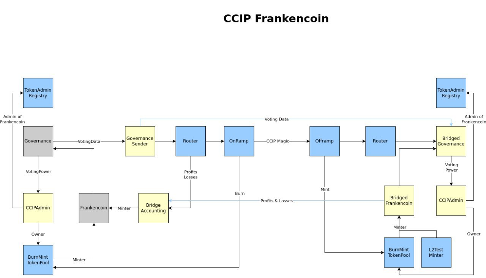

# Bridge to other Chains

\[TODO: Under construction]

\[TODO: Screenshot of /transfer page and how to (including fee explanation)]

\[TODO: list of supported chains and the token contract address on each chain]

### Technical Background

<figure><figcaption></figcaption></figure>
