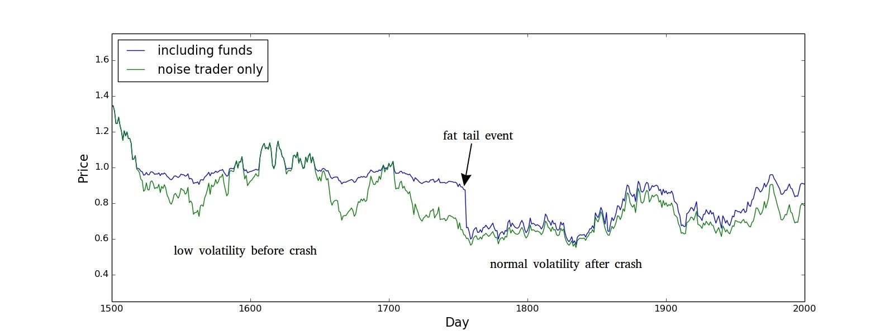

# 🚒 Risks

## For Frankencoin Holders

### Fundamental Depeg

The fundamental value of the Frankencoins in circulation rests on the market value of the collateral in the system. If the value of the collateral that backs the Frankencoins drops too much and too fast, the fundamental value of one Frankencoin falls below 1.00 CHF (a downwards depeg).

All collateral in the system is bound to specific positions and belongs to the respective owner of that position. The collateral of one position cannot be used to cover the debt of another position. **This means that the Frankencoin can depeg even if the total collateral exceeds the total amount of Frankencoins in the system.** Also, the Frankencoin system relies on a relatively slow liquidation mechanism that is based on auctions that can last multiple days. Historically, this would have been a strength as sudden crashes - for example due to a cascade of forced liquidations in the overall markets - tend to be followed by technical rebounds. However, there is no technical rebound if the fundamental value of a collateral drops suddenly - for example if a company whose shares are used as a collateral is unexpectedly closed by a regulator or if the main production site of a tokenized company is flooded without having appropriate insurance coverage. While liquidation cascades tend to pull down the whole market at once, idiosyncratic risks of individual collateral assets can often be addressed through diversification. That is why all participants of the Frankencoin ecosystem should favor having a wide range of supported collateral assets.

### Temporary Depeg / Liquidity Risk

There is a risk that you cannot buy or sell ZCHF at its fundamental value because the market is not liquid enough to satisfy the current demand. Academics often measure market liquidity by testing how much slippage a large trade causes. Slippage is the extent to which the price moves when buying or selling. For example, the indicated ZCHF price on an exchange might be 1.00 CHF, but when selling 100'000 ZCHF at once, the price you get might be only 0.98 CHF as your order eats through the order book. In that example, slippage would be 2%. A widespread method to handle this risk is to slice large orders into several smaller one to give the market time to recover. However, obvious slicing can increase frontrunning risks as an attentive market maker might anticipate subsequent trades.

## For Minters (Borrowers)

### Missing Maturity Dates

All minter's positions come with a maturity date that can be years in the future. It is recommended that you mark the due date of your positions in your personal calendar. Furthermore, there is [Notification Bot](telegram-api-bot.md) that can notify you about expiring positions in general. When missing the maturity date of a position, it falls into a liquidation mode where the posted collateral is sold to the highest bidder in a Dutch auction, starting at 10x the liquidation price. The proceeds are used to repay the position and you can recover the excess amount, but you will lose the minter's reserve.&#x20;

### Missing Market Movements

Minter's that do not keep an eye on the market are at risk of being forcefully liquidated when the market price falls below the liquidation price. It is highly recommended to watch the markets and to subscribe to the [Notification Bot](telegram-api-bot.md) in order to be notifed when the market price approaches the liquidation price of a position. In the event of a liquidation, the minter loses the minter's reserve.

### Third Line Bailout

The Frankencoin system has three lines of defense to hold the peg of the Frankencoin when collateral falls below the liquidation price. The first line of defense is the reserve of the position itself whose collateral has fallen below the liquidation price, typically 25% or so. If the price falls by more than that, i.e. 40% or so, the minter's reserve of that position does not suffice and the system uses equity capital to cover the loss. But if that does not suffice either, all the minter reserves are collectively used to cover the loss. So even if your position is perfectly sound, you might still have to pay for the losses caused by the unsound position of others. This risk is best addressed by acquiring some Frankencoin Pool Shares (FPS) and to activaly participate in the system's governance. You (or you together with others) only need 2% of the votes to veto collaterals that you deem unsound.

### Swiss Franc Appreciation

By borrowing a Swiss franc stablecoin, you take what trades call a "short" position in Swiss francs. Being short means that your portfolio loses value as the Swiss franc appreciates. And historically, the Swiss franc is the most stable currency in the world. A few years ago, a lot of [home owners in Eastern Europe took mortgages in Swiss francs](https://www.tandfonline.com/doi/full/10.1080/13604813.2023.2229695). They thought they are smart as that allowed them to get mortgages at very low nominal interest rates. However, in the end, this cost them dearly as the price of the Swiss franc appreciated much faster than they anticipated and their debt grew significantly when measured in the local currencies. In efficient markets, the rule of [Uncovered Interest Rate Parity](https://en.wikipedia.org/wiki/Interest_rate_parity) holds. This rule says that if the dollar interest is 5% and the Swiss franc interest is 1%, the market expects the Swiss franc to appreciate 4% per year against the dollar. This rule also means that you don't gain anything at average by taking debt in a different currency. However, markets are often not efficient, especially when there is political interest to keep interest rates artificially low, putting pressure on the Swiss franc to appreciate more than interest rates would suggest, thereby also increasing the risks associated with being short the Swiss franc.

### Short Squeeze (Upwards Depeg)

This risk is similar to the appreciation risk, but with the appreciation being engineered through market manipulation. Since all Frankencoin debt is denominated in Frankencoins and not in Swiss francs, a resourceful attacker might try to do a so-called short-squeeze by cornering the ZCHF market. The attacker might observe the maturity of the outstanding Frankencoin debt and wait for large amounts being due for repayment. Once this is the case, they buy as many Frankencoins as they can ("cornering the market"), causing the price to climb far above 1.00 CHF. So when the borrowers want to repay their debt, they have to do so by buying overpriced Frankencoins from the attacker. This risk can be alleviated by rolling over debt and waiting until the peg is reached again. Also, it makes minting (or borrowing) additional Frankencoins more attractive as they can be sold at a premium to the attacker. A short-squeeze therefore also comes with significant risk also for the attacker and the longer they have to maintain the articifially high price, the more expensive the attack becomes. Nonetheless, borrowers need to be aware that the Frankencoin could trade significantly above parity for extended periods of time. As an example, between June 2022 and January 2023, the [decentralized stablecoin LUSD](https://coinmarketcap.com/currencies/liquity-usd/) traded consistently 2% and sometimes up to 5% above the peg. This was not due to a short squeeze, but due to borrowers wanting to get their ETH collateral back so they could stake them while holders of LUSDs were reluctant to sell them.

### Liquidation Cascades

Liquidation cascades happen when market participants globally are overleveraged, such that a small dip can trigger a widespread sell-off as investors are forced to unwind and liquidate their positions. The presence of well-informed traders that use leverage to increase their returns reduces volatility most of the time, but at the same time creates a risk of rare extreme events. Researchers sometimes refer to this phenomoenon as [clustured volatility](http://dido.econ.yale.edu/~gean/art/p1371.pdf).&#x20;

<figure><figcaption></figcaption></figure>

The chart above shows how the market behaves under the model of Thurner et al. with (blue) and without (green) leverage. One can see that in normal times, the possibility of leverage makes markets more smooth as informed traders can take loans to buy the asset when it is fundamentally underpriced. But if there is too much leverage, a small price distortion can force a cascade of liquidations, pushing the market price way below the fundamental value of the asset. Afterwards, the blue and the green line move very similarly again as the wealth of the leveraging market participants was wiped out and they lack the capital to influence the market much. Even those participants that only took moderate leverage are at risk of forced liquidations as a previously calm market falls off a cliff. This is likely what for example happened on Saturday 2026-01-31, as billions worth of crypto currencies were sold in forced liquidations and the Bitcoin price fell by 6% within hours. Traditional markets have so-called "circuit brakers" and halt trading in extreme events. Crypto markets don't have that and therefore the risk of getting caught in a market sell-off and being liquidated is elevated, especially on weekends, when trading volumes are thin. While those market participants that use leverage in the above theoretical model are those that make the most money in normal times, they suffer disproportionately in stress scenarios.

## General Risks

### Technical Attacks

Despite several security audits, we cannot rule out that the smart contracts of the Frankencoin system can be exploited through an elaborate attack. In the worst case, such an attack would allow someone to print arbitrary amounts of Frankencoins or to get control of other people's Frankencoins.

There are also some potential smaller attacks that were discovered in the security audits that we deemed not worth fixing. These include the potential to be frontrun by bots when interacting with the Frankencoin system. For example, an MEV-bot might frontrun a bid in an auction. One way to address this is to use wallets (like Metamask) that do not send their transactions to the public mempool so your transactions are not visible to others until they are executed.

### Frontend Hacks

Some of the [most spectacular crypto heists](https://www.sygnia.co/blog/sygnia-investigation-bybit-hack/) were done through frontend hacks. If an attacker succeeds in getting access to the frontend servers or succeeds in sneaking malicious code into the frontend, they can manipulate the data shown in the frontend and the actions triggered when interacting with the frontend. For example, clicking the "transfer" button in a hacked Frankencoin frontend might trigger a transfer to a completely different address than what is indicated on the website. The best way to address this is to be very attentive to what is being signed when verifying transactions in your wallet. Unfortunately, the transaction data typically shown in wallets is rather cryptic, especially for non-standard transactions. Some wallets, for example Metamask, simulate and show the anticipated token transfers of a transaction, which helps a lot.

### Human Errors

Many users rely on non-custodial wallets. This brings independence, but also responsibility. A lot of crypto assets have already been lost by users who did not back up their seed phrase or who accidentally sent funds to the wrong account. The best way to address this problem is to store your crypto assets with an intermediary like [Bitcoin Suisse](https://bitcoinsuisse.com/) or [Coinbase](https://www.coinbase.com/). However, that makes you dependent again.

### Governance Failures

The Frankencoin is designed to incentivize all system participants to behave well. Nonetheless, there is a significant risk that system participants turn lazy and inattentive, thinking that others will take care of the governance for them. In such a scenario, the FPS holders might fail to veto an unsound collateral or fail to veto a faulty extension of the system. To address this issue, all system participants are encouraged to actively take part in the governance process. Frankencoin's governance system allows anyone to make proposal and only has a very low entry barrier for casting vetos, making it more decentralized by nature. Nonetheless, a governance failure can lead to the destruction of the whole system within days. For example, if an unsound collateral is approved and used to mint irresponsible amounts of Frankencoins, the Frankencoin and the Frankencoin Pool Shares will lose their value very quickly.

### Regulatory Risks

While their are established rules to [legally classify](https://www.frankencoin.com/compliance#compliance-summary) crypto currencies like the Frankencoin, interacting with decentralized system still bears significant risks. For example, there is uncertainty about when a DeFi user has the duty to identify a counterparty. Therefore, financial institutions are often hesitant to interact with decentralized finance protocols.

Also, the tax implications of holding crypto assets are often unclear. For the Frankencoin system, one can assume that one Frankencoin has a tax value of one Swiss franc and that interests earned from the savings module are taxable income. To simplify tax reporting, Frankencoin Association has created a [report tool](https://app.frankencoin.com/report) that summarizes your holdings and incomes by the end of each year.

There is a non-negligible risk that the responsible authority arrives at the (wrong) conclusion that the Frankencoin system violates financial market laws, which could lead them to to attempting to shut down the system. They could for example try to do so by scaring participants from taking part in the governance process, which could lead to a governance failure and severe financial harm for all participants.

### Unknown Risks

There are likely additional risks that have not been foreseen (or neglected) by the authors of this page. If you are aware of any such risk, please let us know through the [community channel](https://t.me/frankencoinzchf).
