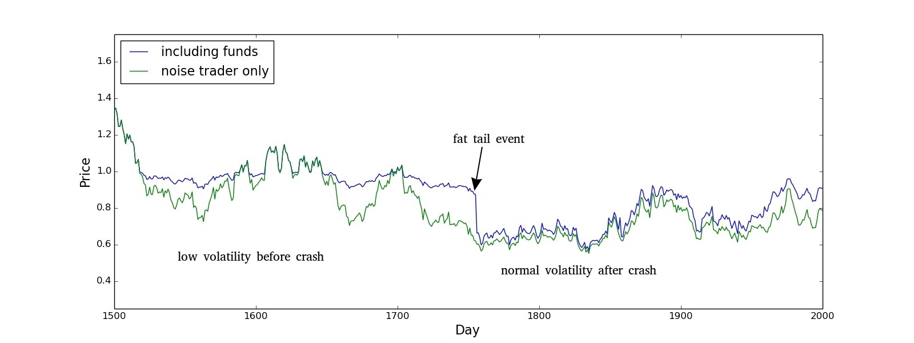

# 🚒 Risks

## For Frankencoin Holders

### Fundamental Depeg

ZCHF depends on the value recoverable from collateral and reserves. A fall in collateral value can leave a shortfall after liquidation. Each position's collateral secures that position; it does not automatically cover another position's debt. **Aggregate collateral value above total ZCHF supply therefore does not rule out a shortfall.**

Auctions can last days. A temporary price fall may reverse during that time, but a permanent loss of collateral value does not. The affected minter reserve absorbs losses first, followed by equity and then shared minter reserves. Challenger rewards and settlement details also affect the amount available; a 20% reserve does not imply exactly 20% price protection after all costs. [Reserve accounting](reserve.md) shows an explicit example.

### Collapse of Connected Stablecoins

A stablecoin-conversion bridge holds an external asset against ZCHF issuance. If the issuer fails or the asset loses value, the system can incur a loss. Minting limits and expiry constrain the route; they do not remove existing issuer exposure.

Earlier documentation described an XCHF bootstrap bridge and a VCHF bridge with an expiry of **15 April 2026**. These are historical references. As of this documentation revision on **18 September 2026**, those references do not establish which route is active, renewed or replaced. The [governance application](https://app.frankencoin.com/governance) and the selected bridge's contract state provide its identity, limit and expiry. A stablecoin-conversion bridge is distinct from a cross-chain ZCHF bridge.

### CCIP and Blockchain Hacks

Cross-chain transfers rely on [Chainlink CCIP](https://chain.link/cross-chain), the bridge contracts and the participating blockchains. A compromised chain or message path can affect issuance and collateral backing on other chains. Rate limits constrain flows; qualified governance can change those limits, including setting them to zero. The audited FCS governance design applies rate-limit changes immediately, while chain removal has a waiting period. [Cross-chain voting](governance.md#cross-chain-governance) has separate snapshot dependencies.

### Temporary Depeg / Liquidity Risk

The ZCHF market price can differ from its intended Swiss franc value when available liquidity does not match order size. Selling 100,000 ZCHF at an average 0.98 CHF when the displayed price is 1.00 CHF gives 98,000 CHF before fees: a 2% difference. Splitting an order changes execution timing and can expose later trades to price movements or anticipation by other traders.

## For Minters (Borrowers)

### Missing Maturity Dates

At expiry, the applicable position version allows a forced sale. In the [pinned newer minting implementation](positions/README.md#contract-versions), the sale starts from ten times the stored liquidation price and declines under the hub's pricing rules. It is a separate path from a collateral challenge.

The newer `Position.forceSale` uses assigned reserve in settlement. If sale proceeds plus available reserve cover the gross debt, the owner receives `proceeds + returnedReserve - minted`. Otherwise, proceeds reduce debt, and remaining collateral or the loss-settlement branch determines what follows. **Expiry does not unconditionally forfeit the full minter reserve.** Legacy deployments must be read under their own settlement rules.

The [notification bot](telegram-api-bot.md) source includes expiry alerts, but delivery depends on indexing and the bot service. The position's on-chain expiry remains the operative deadline.

### Missing Market Movements

A position becomes economically challengeable when market value falls below its stored liquidation price. Adding collateral does not lower that price automatically; [an explicit adjustment](positions/adjust.md#lowering-the-liquidation-price) is needed. The notification bot's price alerts depend on its off-chain price feed and subscription state. A successful challenge allocates the associated reserve under the settlement rules; it is not the same as an ordinary voluntary repayment.

### Third Line Bailout

If the affected position's reserve and equity do not cover a loss, shared minter reserves can absorb it. Another borrower's otherwise sound position may then have less assigned reserve available for repayment. Qualified FCS holders can veto new proposals through [governance](governance.md#veto-process); qualification needs internal FCS voting power and the FCS contract meeting the underlying FPS quorum.

### Swiss Franc Appreciation

ZCHF debt is a Swiss franc-denominated liability. If the Swiss franc appreciates against a borrower's income or collateral currency, servicing the debt becomes more expensive in that currency. A lower nominal interest rate does not remove exchange-rate exposure. The [experience of foreign-currency mortgages](https://www.tandfonline.com/doi/full/10.1080/13604813.2023.2229695) illustrates this distinction; [interest-rate parity](https://en.wikipedia.org/wiki/Interest_rate_parity) is a model, not an exchange-rate forecast.

### Short Squeeze (Upwards Depeg)

Repayment requires ZCHF, not Swiss francs. Concentrated demand near maturity can push ZCHF above parity, making repayment more expensive. New minting may add supply, but it requires eligible collateral, available capacity and time. Rolling a position also depends on the available route and terms; it is not an unconditional escape from repayment demand.

### Liquidation Cascades

Leverage can amplify price falls when forced sellers enter a falling market. Even positions with moderate leverage can become exposed after a period of low volatility. The [model by Thurner and co-authors](http://dido.econ.yale.edu/~gean/art/p1371.pdf) illustrates this effect.

<figure><figcaption>
Illustrative model: leverage can smooth ordinary price movements while amplifying a liquidation cascade.
</figcaption></figure>

## FCS mechanisms and dependencies

The [FCS reference](fcs.md) and [migration guide](fcs-migration.md) describe the final V3 mechanics assessed by ChainSecurity on 14 July 2026. The relevant dependencies are:

* **Equity exposure:** FCS participates in the reserve's gains and losses through underlying FPS. Savings expense, losses and new capital change the economics; an FCS market sale and protocol redemption can have different proceeds.
* **Two voting layers:** credited holder votes do not create the wrapper's underlying FPS age. A legacy `kamikaze` can reduce wrapper votes below the underlying quorum.
* **Binding and exits:** ZCHF redemption needs binding and the wrapper's FPS holding-duration eligibility. V3 unwrapping has a holder-average duration condition and remains possible while binding.
* **Discounted exits:** proceeds depend on size and recent activity. The 10% cap applies to `withdraw`, not `redeem`. Large `redeem` calls can burn more shares for less ZCHF; finding #012 remains accepted rather than code-corrected.
* **Legacy vote destruction:** while binding, permissionless `shoot` destroys accumulated FPS votes without burning the target's FPS balance. Repeated calls can delay recovery of legacy redemption eligibility.
* **Cross-chain snapshots:** stale or selectively updated votes can change effective qualification. Late execution of old failed messages can overwrite newer state; synchronisation can overwrite local delegations.
* **Proposal monitoring:** stale minter announcements can leave gaps in bypass enforcement. The audit assumes active monitoring and no malicious majority of FCS voting power after binding.
* **Underlying contracts and CCIP:** the wrapper uses the underlying contracts for pricing, vote accounting and redemption, and CCIP for cross-chain messages.

The report records code corrections, specification changes, acknowledgements and accepted risks; these are not all equivalent to code fixes. Sources: [trust model, SC1–SC5 and findings #005, #006, #010, #012, #025 and #028](https://reports.chainsecurity.com/Frankencoin/ChainSecurity_Frankencoin_FPS2_Audit.pdf#page=9).

## General Risks

### Technical Attacks

Contract defects can affect balances, issuance or transaction execution. Audits assess a defined scope and version; they do not remove every possible defect.

Publicly visible transactions can be reordered or preceded by other transactions, including auction bids. MEV protection depends on the **network, RPC and submission route**, not the wallet brand. For example, [MetaMask Smart Transactions](https://support.metamask.io/manage-crypto/transactions/smart-transactions) applies under its supported-network and transaction conditions; settings and custom RPCs affect the route. Private submission does not prevent every form of MEV.

### Frontend Hacks

An altered interface can show one recipient or operation while asking the wallet to sign another. The [Bybit incident analysis](https://www.sygnia.co/blog/sygnia-investigation-bybit-hack/) describes an example of interface compromise. Transaction data and simulation identify the operation being signed; a displayed page balance alone does not.

### Human Errors

A lost signing key can make a balance inaccessible. A transfer to the wrong address may be irreversible. Custodial services replace some key-management responsibilities with dependence on the custodian.

### Governance Failures

An unchallenged bad proposal can authorise unsound collateral or a minting module with broad powers. The veto process depends on holders examining proposals and acting in time. The same economic exposure that motivates participation does not guarantee it.

### Regulatory Risks

The [compliance page](https://www.frankencoin.com/compliance#compliance-summary) provides regulatory information. The [report tool](https://app.frankencoin.com/report) records holdings and income.

### Unknown Risks

This page describes known failure modes, not an exhaustive list. Documentation corrections can be raised in the [community channel](https://t.me/frankencoinzchf).
