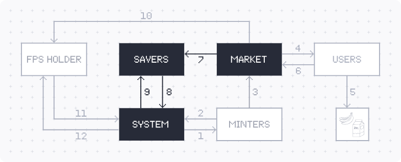

# 💰 Savings

### Overview

The savings module ([frontend](https://app.frankencoin.com/savings),  [source code](https://github.com/Frankencoin-ZCHF/FrankenCoin/blob/main/contracts/Savings.sol), [deployed contract](https://etherscan.io/address/0x3bf301b0e2003e75a3e86ab82bd1eff6a9dfb2ae)) takes money out of the equity pool and gives it to Frankencoin holders that have stored some of their Frankencoins in the savings module. The transferred amount depends on the currently applicable interest rate.

<figure><figcaption>
Savers can acquire ZCHF (7), store them in the savings module (8) and earn an interest (9) paid for by the system.
</figcaption></figure>

### Saving

Anyone can store Frankencoins in the savings module. These Frankencoins are attributable to their owner at all times (i.e. they are fully segregated) and stay in the savings module until their owner withdraws them again. There is no lending or other transfer happening in the background. Also, unlike the minter reserves, the stored Frankencoins cannot be touched to save the system in case of a depeg.

### Lockup

Once Frankencoins are sent to the savings module, they are subject to a lock-up period of three days. During these three days, they cannot be withdrawn and there is no interest. The purpose of the lock-up period is to discourage users from trying to earn an interest on Frankencoins that are held temporarily for transactional purposes. In case the user already has some Frankencoins in his savings account, the applicable lock-up period is a weighted average between the already stored and the newly added Frankencoins. For example, if a user that has saved 200 ZCHF two days ago adds 100 ZCHF, the resulting 300 ZCHF will be locked up for one day and eight hours ((200\*24h + 100\*72h)/300=32h). Once the lockup period has passed, the users are free to withdraw their stored Frankencoins at any time. In the unlikely case of the interest rate changing during the lockup period, the lockup period can get distorted. For example, if the interest rate is cut in half, the remaining lockup period doubles. If you want to avoid this side-effect, refrain from adding Frankencoins to the savings module if an interest rate change is imminent.&#x20;

### Risks

The main risk for the savers is the depeg risk, i.e. the Frankencoin having an exchange rate below 1.00 Swiss franc when the saved Frankencoins are withdrawn again. An additional small risk is that the interest rate can only be added to the balance as long as the system is solvent. The interest is paid from the equity capital of the system and if there is no equity capital left, no interest can be paid. There is no counterparty risk as the Frankencoins are never transferred outside the savings module. The users can be sure to get the stored Frankencoins back.

### Interest

The applicable interest rate is always the current lead interest of the system. The lead interest can be changed through the Frankencoin [governance ](governance.md)system with a delay of seven days. It is given in percent per 365 days, so in leap years, the users can earn slightly more than in normal years. As soon as the lead interest changes, the applicable interest changes. For simplicity, the interest is only calculated on the principal amount. There is no interest on the accrued interest. However, it is possible to collect the interest and add it to the principal amount by calling the "refresh" function for a specific account. When doing so, no additional lockup is applied. The interest is automatically collected and added to the account whenever funds are added or withdrawn.
