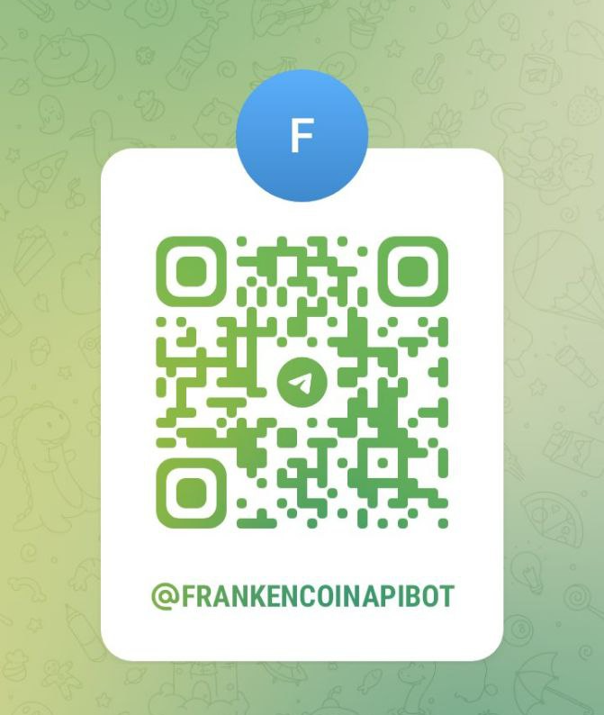

# Telegram Api Bot

The Frankencoin API Telegram Bot is a communication tool designed to keep users informed about various activities and updates within the Frankencoin ecosystem.

-   Welcome and Help Functions: The bot welcomes new users or groups and provides help information on demand.
-   Basic Messages: The bot will inform any user or group about basic updates.
-   Subscription Management: Users can subscribe to different types of updates using specific handles like /MintingUpdates.
-   Quick Access: The bot provides direct links to the Frankencoin app, blockchain explorer for relevant addresses and transactions, and the GitHub repository.

# How to find it?

> Telegram Name: **@FrankencoinApiBot**

https://t.me/FrankencoinApiBot

# Basic Messages

### Welcome and Environment Information

The bot welcomes new users or groups and provides help information on demand.
It shares details about the current API version, blockchain network, and timestamp of messages.

### Minter Proposals

The bot announces new minter proposals, including application periods and relevant transaction details.

### Minter Proposals Vetoed

The bot notifies if a minte proposal got vetoed through the governance process.

### Position Proposals

The bot notifies users about new position proposals, including details such as minting limits, interest rates, and collateral information.

### Challenges Started

It informs users when new challenges are started, providing information about the challenger, challenge size, and auction details.

# Subscription Handels

Use the command `/help` to get your subsctiption state. Use and handle to subscribe or unsubscribe, its a toggle function.

### Minting Updates

It provides updates on minting activities, including changes in minted amounts, collateral ratios, and fee information.

